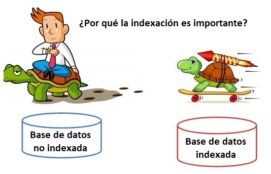

<div align="center">

# Tarea 1: Trabajo con índices

</div>
<br>
<div aling="justify">

### Un instituto de enseñanza guarda los siguientes datos de sus alumnos:

- número de inscripción, comienza desde 1 cada año.
- año de inscripción.
- nombre del alumno.
- documento del alumno.
- domicilio.
- ciudad.
- provincia.
- clave primaria: número de inscripto y año de inscripción.

---

- Antes de comenzar debemos ejecutar MySQL.

``` bash
sudo mysql -u root -p
```

- Vemos que base de datos hay.

``` sql
SHOW DATABASES;
```

- Creamos la base de datos de la tarea:

``` sql
CREATE DATABASE tarea1index;
```

- Usamos la base de datos creada.

``` sql
USE tarea1index;
```

Ya tendremos la base de datos preparada para realizar lo que se pide

----

**Se pide:**

- **Elimine la tabla "alumno" si existe.**

*Comando*

``` sql
DROP TABLE IF EXISTS alumno;
```

*Salida*

``` sql
Query OK, 0 rows affected, 1 warning (0,00 sec)
```

- **Cree la tabla definiendo una clave primaria compuesta (año de inscripción y número de inscripción).**

*Comando*

``` sql
CREATE TABLE alumno (
    numero_inscripcion INT,
    anio_inscripcion INT,
    nombre VARCHAR(50),
    documento VARCHAR(20),
    domicilio VARCHAR(50),
    ciudad VARCHAR(50),
    provincia VARCHAR(50),
    PRIMARY KEY (anio_inscripcion, numero_inscripcion));
```

*Salida*

``` sql
Query OK, 0 rows affected (0,03 sec)
```

- **Define los siguientes indices:**

    - **Un índice único por el campo "documento" y un índice común por ciudad y provincia.**

    Nota: Muestra el comando y la salida. Justifica el tipo de indice en un comentario.

    *Comando*

        - UNIQUE: Los valores duplicados no son permitidos.s

    ``` sql
    CREATE UNIQUE INDEX index_documento ON alumno (documento);
    ```

    *Salida*

    ``` sql
    Query OK, 0 rows affected (0,03 sec)
    Records: 0  Duplicates: 0  Warnings: 0
    ```

    *Comando*

        - Sin UNIQUE: Admite valores duplicados.

    ``` sql
    CREATE INDEX index_ciudad_provincia ON alumno (ciudad, provincia);
    ```

    *Salida*

    ``` sql
    Query OK, 0 rows affected (0,02 sec)
    Records: 0  Duplicates: 0  Warnings: 0
    ```

- **Vea los índices de la tabla.**

Nota: Muestra el comando y la salida "show index".

*Comando*

``` sql
SHOW INDEX FROM alumno;
```

*Salida*

``` sql
+--------+------------+----------------------+--------------+--------------------+-----------+-------------+----------+--------+------+------------+---------+---------------+---------+------------+
| Table  | Non_unique | Key_name             | Seq_in_index | Column_name        | Collation | Cardinality | Sub_part | Packed | Null | Index_type | Comment | Index_comment | Visible | Expression |
+--------+------------+----------------------+--------------+--------------------+-----------+-------------+----------+--------+------+------------+---------+---------------+---------+------------+
| alumno |          0 | PRIMARY              |            1 | ano_inscripcion    | A         |           0 |     NULL |   NULL |      | BTREE      |         |               | YES     | NULL       |
| alumno |          0 | PRIMARY              |            2 | numero_inscripcion | A         |           0 |     NULL |   NULL |      | BTREE      |         |               | YES     | NULL       |
| alumno |          0 | idx_documento        |            1 | documento          | A         |           0 |     NULL |   NULL | YES  | BTREE      |         |               | YES     | NULL       |
| alumno |          1 | idx_ciudad_provincia |            1 | ciudad             | A         |           0 |     NULL |   NULL | YES  | BTREE      |         |               | YES     | NULL       |
| alumno |          1 | idx_ciudad_provincia |            2 | provincia          | A         |           0 |     NULL |   NULL | YES  | BTREE      |         |               | YES     | NULL       |
+--------+------------+----------------------+--------------+--------------------+-----------+-------------+----------+--------+------+------------+---------+---------------+---------+------------+

```

- **Intente ingresar un alumno con clave primaria repetida.**

Nota: Muestra el comando y la salida.


*Comando*

``` sql
INSERT INTO alumno (numero_inscripcion, anio_inscripcion, nombre, documento, domicilio, ciudad, provincia)
VALUES (1, 2024, 'Juan Perez', '12345678', 'Calle 123', 'Ciudad A', 'Provincia X');
```

*Salida*

``` sql
Query OK, 1 row affected (0,01 sec)
```

- **Intente ingresar un alumno con documento repetido.**

Nota: Muestra el comando y la salida.

*Comando*

``` sql
INSERT INTO alumno (numero_inscripcion, anio_inscripcion, nombre, documento, domicilio, ciudad, provincia)
VALUES (2, 2024, 'Maria Lopez', '12345678', 'Calle 456', 'Ciudad B', 'Provincia Y');
```

*Salida*

``` sql
ERROR 1062 (23000): Duplicate entry '12345678' for key 'alumno.idx_documento'
```

- **Ingrese varios alumnos de la misma ciudad y provincia.**

Nota: Muestra el comando y la salida.

*Comando*

``` sql
INSERT INTO alumno (numero_inscripcion, anio_inscripcion, nombre, documento, domicilio, ciudad, provincia) 
VALUES (3, 2024, 'Pedro Ramirez', '87654321', 'Calle 789', 'Ciudad A', 'Provincia X'), (4, 2024, 'Ana Martinez', '98765432', 'Calle 012', 'Ciudad A', 'Provincia X');
```

*Salida*

``` sql
Query OK, 2 rows affected (0,02 sec)
Records: 2  Duplicates: 0  Warnings: 0
```

- **Elimina los indices creados, y muestra que ya no se encuentran.**

Nota: Muestra el comando y la salida.

*Comando*

``` sql
DROP INDEX idx_documento ON alumno;
```
``` sql
DROP INDEX idx_ciudad_provincia ON alumno;
```
``` sql
SHOW INDEX FROM alumno;
```

*Salida*

``` sql
Query OK, 0 rows affected (0,02 sec)
Records: 0  Duplicates: 0  Warnings: 0
```
``` sql
Query OK, 0 rows affected (0,02 sec)
Records: 0  Duplicates: 0  Warnings: 0
```
``` sql
+--------+------------+----------+--------------+--------------------+-----------+-------------+----------+--------+------+------------+---------+---------------+---------+------------+
| Table  | Non_unique | Key_name | Seq_in_index | Column_name        | Collation | Cardinality | Sub_part | Packed | Null | Index_type | Comment | Index_comment | Visible | Expression |
+--------+------------+----------+--------------+--------------------+-----------+-------------+----------+--------+------+------------+---------+---------------+---------+------------+
| alumno |          0 | PRIMARY  |            1 | ano_inscripcion    | A         |           0 |     NULL |   NULL |      | BTREE      |         |               | YES     | NULL       |
| alumno |          0 | PRIMARY  |            2 | numero_inscripcion | A         |           0 |     NULL |   NULL |      | BTREE      |         |               | YES     | NULL       |
+--------+------------+----------+--------------+--------------------+-----------+-------------+----------+--------+------+------------+---------+---------------+---------+------------+
```
</div>